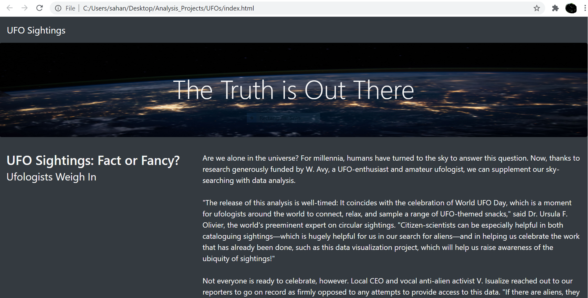
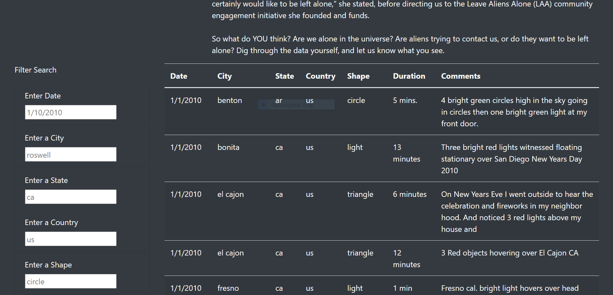
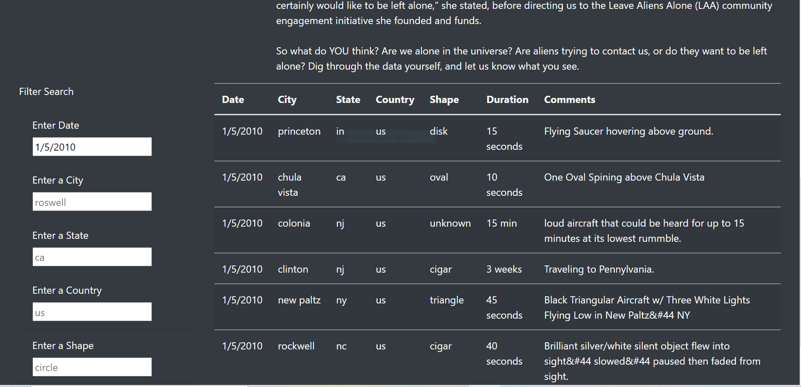
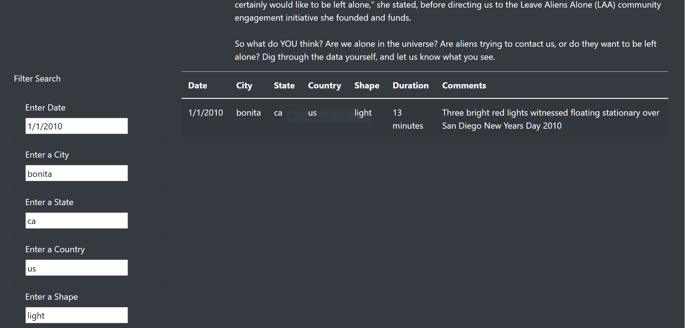

# UFOs
## PURPOSE
The goal of this project is to create a webpage for Dana with a dynamic table. This webpage provides an in-depth analysis of UFO sightings. 
It allows users to use  one to multiple criteria at the same time and get the required data like date city state country etc.
Once the webpage is loaded the user can enter their search criteria, either one or many criteria is in each input box Below the input box labels.

## RESULTS
The following image shows how the website looks when its first loaded.
 

On the left side under the filter search label we can filter for example a date, the table shows the data specific to the searched filter in the Image below

Here is an example of just using one filter search like date!(rest of the input box entries are default )

The following image also shows the table on the right which is filtered when we enter multiple search criteria’s.

## SUMMARY
- A drawback in this analysis project is that the user is  not aware of The time period to use to search for the required data. We also need more people to use the website to even comment on its drawbacks.Another Draw back is that, if a wrong  search  criteria  or a  search entered which is not in the data, then a message to the user would help ,saying invalid data or error. 
- The webpage can be improved with a filter button which makes it more easier for the user an interactive.
- since some of the data is unknown for the user to input, a drop down menu for all the input boxes will help the user to easily select what they need. Example –The types of shapes drop-down menu for entering a shape, A date range or a calendar to select the dates
These minor changes will make a big difference and more user friendly.
